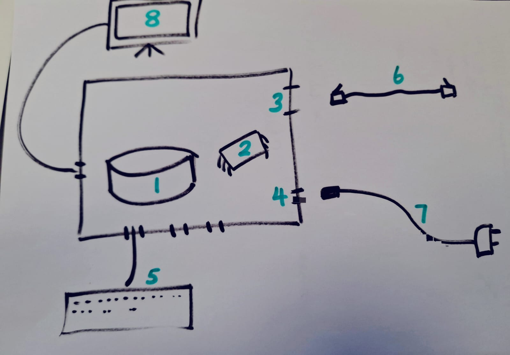

:::::::::::::::::::::::::::::::::::::: questions 

- "What hardware components make a device capable of networking?"
- "How do we physically assemble and boot a Raspberry Pi?"
- "What is the difference between regular user commands and administrative (`sudo`) commands?"

::::::::::::::::::::::::::::::::::::::::::::::::

::::::::::::::::::::::::::::::::::::: objectives

 - name the essential components of a networkable device
 - connect up peripherals to a networkable device
 - log in to a console on the device
 - explain the difference between standard user, root user and sudo

::::::::::::::::::::::::::::::::::::::::::::::::

## Introduction

A **networkable device** is any computing hardware containing a processor, memory, an operating system, and a Network Interface Card (NIC)—either wired (Ethernet) or wireless (Wi-Fi)—that enables it to send and receive data according to standard communication protocols.

## Anatomy of a Networkable Device

```
[ 1: Ethernet Port ]   [ 2: USB Ports ]
                  |                     |
     +------------+---------------------+----+
     |   [ETH]                         [USB] |
     |                                 [USB] |
     |   +---------+     +---------+         |
     |   | 3: CPU/ |     | 4: RAM  |         |
     |   | SoC     |     +---------+         |
     |   +---------+                         |
     |                                       |
     | [PWR]      [HDMI]               [SD]  |
     +---+----------+--------------------+---+
         |          |                    |
[ 5: Power ]   [ 6: Micro-HDMI ]   [ 7: MicroSD Slot ]
```

* **System on Chip (SoC) / CPU:** The central engine executing instructions.
* **RAM (Memory):** Volatile workspace holding active network packets, OS routines, and running programs.
* **MicroSD Card Slot (Storage):** Non-volatile storage containing the operating system (Raspberry Pi OS) and file system.
* **Network Interfaces (Ethernet / Wi-Fi chip):** The physical controllers converting software messages into electrical signals or radio frequencies.
* **USB & Display Ports (I/O):** Input/Output interfaces allowing human interaction via keyboard, mouse, and monitor.

::::::::::::::::::::::::::::::::::::: challenge

### Match the Components


{alt='Line art diagram showing a central board with a processing chip and storage module, along with ports for networking, power and screena nd keyboard peripherals.'}


Match the numbered markers on the board layout above to the correct component name from the word bank below. 

::::: hint 
The word bank contains more terms than needed.
:::::

*Bonus: Is the component absolutely necessary for a networkable device?*

**Word Bank:**
* Storage
* Network Interface
* Keyboard
* Power Cable
* Processing Unit (CPU)
* PCIe x16 Slot
* Network Cable
* VGA Port
* RAM
* USB 2.0/3.0 Ports
* Screen
* Power Source


::::::: solution
1. Storage - necessary
2. Processing Unit (CPU) - necessary
3. Network Interface - necessary
4. Power Source - necessary
5. Keyboard - unnecessary
6. Network Cable - unnecessary
7. Power Cable - unnecessary if there is internal power
8. Screen - unnecessary

:::::::::

::::::::::::::::::::::::::::::::::::::::::::::::

::::: instructor
*(Tip for instructors: For an interactive web-based drag-and-drop version, embed an [H5P Image Hotspot / Drag the Words](https://h5p.org/) activity into your built site.)*
:::::::::::::::

---

## Assembling the Hardware

Connecting peripherals establishes communication buses between external input/output devices and the processor before boot initialisation.

1. **Insert Storage:** Slide the flashed MicroSD card into the slot under the board. 
   * *Under the hood:* The board has no onboard hard drive; the bootloader looks directly to this card for the kernel.
2. **Connect Display:** Plug the Micro-HDMI cable into port **HDMI0** (closest to the power jack) and connect the other end to your monitor.
   * *Under the hood:* HDMI transmits uncompressed digital video and audio clocks directly from the GPU.
3. **Connect Input:** Plug the USB keyboard into any standard USB port.
   * *Under the hood:* The USB controller periodically polls the keyboard for scan-codes generated by keypresses.
4. **Apply Power:** Connect the official 5V USB-C power supply *last*.
   * *Under the hood:* Supplying power triggers the hardware power-on sequence: the GPU initializes, loads `bootcode.bin` from the SD card, initializes the CPU, and loads the Linux kernel into RAM.

---

## First Login and Permission Levels

Once the device has booted up, the display presents a terminal console or graphical desktop prompting for credentials. Sometimes the kernel continues writing boot-up messages to the terminal after displaying the login prompt, in which case just press "return" to re-display the login prompt. You should see something like the following

```bash
Debian GNU/Linux 13 raspberrypi tty1

My IP address is 127.0.1.1 ::ffff:127.0.1.1

raspberrypi login: scnet
```

Enter your login information as provided by the lesson instructor (most probably scnet/scnet).

```
raspberrypi login: scnet
Password: 
Linux raspberrypi 6.18.34+rpt-rpi-v8 #1 SMP PREEMPT Debian 1:6.18.34-1+rpt1 (2026-06-09) aarch64

The program inclued with the Debian GNU/Linux system are free software;
the exact distribution terms for each program are described in the
individual files in /usr/share/doc/*/copyright.

Debian GNU/Linux comes with ABSOLUTELY NO WARRANTY, to the extent
permitted be applicable law.
scnet@raspberrypi:~ $
```

## Standard User vs. Superuser (sudo)

Linux maintains strict boundaries between normal computing tasks and administrative modifications:
Standard User (pi): Can create files in their own home directory (/home/pi), run networking diagnostic utilities (ping, curl), and launch standard software. Cannot modify underlying network interfaces or system routing tables.
Superuser (root): The absolute administrator who can change IP assignments, start/stop network daemons, edit firewall rules, and install system packages.
sudo (SuperUser DO): A prefix placed before a command granting temporary root privileges to authorized users (e.g., sudo apt update).

:::::::::::::::::::::::::::::::::::::: callout

Principle of Least Privilege
In networking, running services as root is dangerous. If an attacker exploits a bug in a network program running with standard permissions, their access remains sandboxed. If the compromised service was running with sudo/root, the attacker gains full control over the machine.
::::::::::::::::::::::::::::::::::::::::::::::

:::::::::::::::::::::::::::::::::::: challenge

#### Privilege Check
Which of the following actions require sudo privileges?
Checking your current IP address using ip addr.
Editing the system hosts file at /etc/hosts.
Creating a new text file called notes.txt in your home folder (~/).
Restarting the system networking service with systemctl restart networking.

::: solution
1. No sudo: Viewing network configuration is a read-only action.
2. Requires sudo: /etc/ contains global system configuration files writeable only by root.
3. No sudo: You have full ownership of your user home directory.
4. Requires sudo: Starting, stopping, or restarting core system services affects the entire device and requires administrative rights.
:::
:::::::::::::::::::::::::::::::::::::::::::::::

::::::::::::::::::::::::::::::::::::: keypoints

- Explain how to use markdown with The Carpentries Workbench
- Demonstrate how to include pieces of code, figures, and nested challenge blocks

::::::::::::::::::::::::::::::::::::::::::::::::
