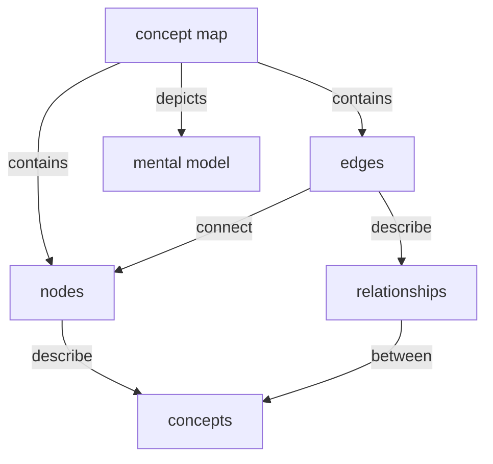

:::info
Users are expected to follow **[The Carpentries Code of Conduct](https://docs.carpentries.org/topic_folders/policies/code-of-conduct.html)**.

All content is publicly available under the [Creative Commons Attribution License](https://creativecommons.org/licenses/by/4.0/).
:::

**Lesson Title:** Introduction to Computer Networks  

<!-- inserts a Table of Contents: don't change the line below -->
[TOC]


## Target Audience

a description of the target audience for your lesson

### Notes

<!--- FIXME add any relevant information about how and why you chose this target audience. 
Information like this can be helpful for future collaborators/contributors/users to understand the scope of your lesson.
--->


1. What is their background?
- L: good foundation in genomics but new to using R and linux.  Uses Mac PC, Apple phone, smart TV

- R: field or lab-based researcher

- F: RSE/ RTP about to start a new project with a networking focus, non compsci background


2. What do they already know how to do?
 
    * Connect to WiFi networks
    * Cast to smart TV


R: Work with unix shell, able to work with scripting languages or shell, an understanding of data, a facility with computer and lab hardware and devices

F: Work with unix shell, coding, understand basics of file management

prerequisite - unix shell workshop or unix shell knowledge

3. What do they want to do with the skills they will learn from your lesson?
F: understand how their data moves around on HPC

R: Build small networks integrating lab equipment / sensors / devices / controllers, connect these networks to the internet, do local processing, communicate with the outside world

F: Understand how hardware talks and what the issues and pitfalls are, to get a better mental model for broad application

4. What problem will your lesson help them solve?
F: mental model of what is connected where in the HPC and of connecting their laptop and online storage

R: Being able to deploy small networks into a field situation especially where there's no other network available or permitted

F: Mental model to help understand the how and why of DevOps processes

### List of prerequisite knowledge
a list of the skills/knowledge your learners will be required to have before they can follow your lesson.

- connecting a device to a WiFi network (authentication)
- what is file & directory
- typing
- web browser
- unix shell knowledge (or have attended unix shell carpentries course)
- idea of what a computer is (drive, OS, network interfaces)

## Lesson Learning Objectives

FIXME fill in the block below with learning objectives for your whole lesson.

### Learning Objectives
After following this lesson, learners will be able to:
 
 Create a network of several devices
 
 give IP addresses to devices
 
* Idenfity key components of networkable device
* Identify the key components of a multi-device network
* *Edit configuration files to configure a networkable device*
* Apply configuration settings for a networkable device
    * Toby: a minor thing but I wonder if you can combine "edit and apply" into a single verb, e.g. "modify" or "adjust"?
* Allocate an IP address to a device on a network
    * Describe TCIP in simple terms
    * Define CIDR subranges
    * Choose appropriate IP addresses for devices to communicate on a subnet
* Navigate the raspian/ piOS
    * connect a keyboard and monitor to a rasperry pi
 * Test a network connection with a ping from one device to another
 * ssh from one device to another using the command line
     * Toby: "ssh" as an action verb, I love it! You might consider re-phrasing, though, in case your learners see the objectives and don't understand what is meant.
 * transfer data from one device to another using shell command scp
     * Toby: Is it important to capture _how_ the transfer will happen? 
 


### Notes

FIXME add any relevant information about how and why you defined these objectives. 
Information like this can be helpful for future collaborators/contributors/users to understand the scope of your lesson.


## Data Set/Narrative

FIXME add notes about any criteria you used when choosing a data set and/or narrative for your lesson.  

* Which datasets and narratives did you consider?

guano temperature up a cliff
temperature in a chicken coop
soil temperature


* How and why did you choose between them?
* What implications do you think your choice of dataset and/or narrative will have for the design and further implementation of your lesson?

"You are starting a project to analyse and evaluate sensor data and are planning to go on the Carpentries python course to learn how to do the anaylsis - but first you need to get your hands on the data!"

Or

"You are starting a research project to measure the guano (bird poo) quality on sea cliffs, you can't climb up the cliffs every day to access the data - it would ruin your shoes - and the SD card will only store a days worth of data at a time, so you need to set up a network to pull the data from your guano sensor to your lab."

"an instrument in a non-accessable environment, which can't be accessed via the internet"

"we're peparing an instrument for the field so we'll set up the network and test it with dummy data before taking up the top of a cliff"

Use a USB stick as a proxy for the USB sensor in the field

Pis have 4 USB ports, 1 RJ75, 2 micro HDMI

- data size matters more than content, good to have more than 1 file with standard naming 
- Can we use soil temp/humidity data from Ag - is it Creative Commons?

* we want a relatable, straightforward scenario

    imagine the sensor is up a sea cliff
    temperature data from a sensor would be easier to understand
    can we provide data beforehand, bake it into the Pi image or provide on USB stick labelled 'sensor'
    
Have the pi be a collator - several sensors feeding into the one pi, then we want to get the latest data from each sensor straight to the lab.

### Data Sources?
Good to have genunie looking data.

Can Robin's soil data be used?

https://data.europa.eu/data/datasets/10-16904_envidat-395-envidat?locale=en Soil moisture

temperature sensors: 
https://data.europa.eu/data/combined?query=temperature+sensor&locale=en&page=1

Dataset
Swedish Historical data temperature sensors (IoT) Public beaches: https://data.europa.eu/data/datasets/https-catalog-sodertalje-se-store-15-resource-9?locale=en

## Episodes
our edges - we don't want to overlap too far with: 

IoT lesson: https://carpentries-incubator.github.io/IoT_arduino_nano/03-simple-ws/index.html

build a miniHPC lesson: ]https://carpentriesoffline.github.io/Building_a_miniHPC_for_Training/

FIXME use this section to take notes as you create a list of episodes for your lesson. 
After you have produced this list, assign one episode to each collaborator in your team.
They will focus on this episode for the rest of this training.


- Introduction
    -  scenario
    -  why network?
- Setting up a Networkable device (Frances)
    - what is a networkable device?
    - essential components
    - how do we interact with it?
    - connecting up peripherals and logging in
    - using sudo
- Configuring your device (Robin)
    - what is a network
    - essential components of a network
    - what do we need to configure to make the device networkable?
        - ip, enable networking
    - check configuration
    - exercise: configure second device
- Connecting your devices  (Carol)
    - connect your devices via ip address
    - test the connection with ping
    - configure a hostname 
        - edit etc/hosts
    - connect via hostname
    - test that connection with ping
    - test that connection with ssh
- Transferring data across devices 
    - connect usb representing sensor to one device
    - ssh and check the data is there
    - scp for file transfer
    - check the data integrity
        - visual check
        - size check
        - checksum
- Optional: DHCP 
    - configure devices to use DHCP
    - ssh to another pi using IP and hostname
> NB: would need an access point or pi set up as a DHCP server
- Optional: Troubleshooting
    - Wrap up episode, where we show troubleshooting means:
        - Start by checking your ssh command
        - Check your ping 
        - Check your IP and hostname
        - Check your physical connections
    So the troubleshooting doubles as a recap


### Episode Learning Objectives
FIXME use the space below to draft a set of learning objectives for your episode.


#### Setting up a Networkable device
After following this episode, learners will be able to:
 
 * name the essential components of a networkable device :heavy_check_mark: labelling
 * connect up peripherals to a networkable device
 * log in to a console on the device
 * explain the difference between standard user, root user and sudo

####  Configuring your device 
After following this episode, learners will be able to:
 
* name the essential components of a network :heavy_check_mark: labelling
* modify config file(s) on the device to make it network ready :heavy_check_mark: (Authentic)
* check the configuration using command line tools :heavy_check_mark: multi match

#### Connecting your devices  (Carol)

* create an IP address network between two devices :heavy_check_mark: (Authentic)
* test a network connection using ping :heavy_check_mark: multi choice
* create a network between two devices using hostnames :heavy_check_mark: (Authentic)
* connect to a console on a remote device using ssh :heavy_check_mark: Multi-choice

#### Transferring data across devices 

* find and check data files on a remote file system
* transfer files across a network using scp
* check the data integrity with visual and size inspection and checksum

#### Optional: DHCP for scalable networks

* configure devices to use DHCP
* connect to a DHCP server and check the assigned IP address
* use nmap to find the addresses of other devices on a DHCP network
* explain the difference between DHCP and DNS?


## Designing Exercises
FIXME use the space below to draft exercises to help you assess learners' progress towards the objectives you defined for your episode.

#### Objective: name the essential components of a networkable device

Drag and drop labels on to a diagram
- Have a diagram with numbers in the place of the components
- Have a list of words (more words than necessary to stretch)
- learners match words from the list with numbers
- (this would be nice as a digital interactive exercise if an appropriate platform is available)

#### Objective: check the configuration using command line tools 

Multi-match exercise
- Ask participants to use `nmcli` and `ip` to check their configuration
- Have a list of possible commands and outputs 
- which would you use?
- what would you expect the output to look like?

#### Objectives: modify config file(s) on the device to make it network ready 

Authentic Assessment: 
- once we have walked through setting up one Raspberry Pi together, ask the participants to set up their second pi in the same way
- setting an IP address and this is set with command line tools.

#### Objective: name the essential components of a network

Drag and drop labels on to a diagram
- Have a diagram with numbers in the place of the components
- Have a list of words (more words than necessary to stretch)
- learners match words from the list with numbers
- (this would be nice as a digital interactive exercise if an appropriate platform is available)

#### Objective: test a network connection using ping

Multichoice:
- Have a list of commands with their outputs
- Ask participants to choose the right one for using ping to test a connection
- The right one must show a successful connection

#### Objective: create a network between two devices using hostnames

Authentic Assessment: 
- ask the participants to connect their devices using hostnames
- then test that this has worked with ping

#### Objective: connect to a console on a remote device using ssh

Multi choice:
- choose the correct ssh command from a list of possible commands
    - [ ] `ssh user@192.168.0.2`
    - [ ] `scp user@192.168.0.2`
    - [ ] `ssh hostname`
    - [ ] `ssh user -ip=192.168.0.2`


#### Objective: create an IP address network between two devices

Authentic Assessment:
- We have pinged with IP then connected with hostname, and shown ssh
- How would you connect with ssh using the IP address?
- Switch to IP connection and try ssh-ing

#### Objective: find and check data files on a remote file system

Unsorted list of commands:
- Have this be all the commands needed for the process of connecting, finding and checking a file
- Ask them to sort these into the right order


### Examples before exercises
FIXME use this space to make some notes about examples/narrative you could use to demonstrate the skills/teach the knowledge that learners will need to complete the exercise(s) you designed above. 


#### Exercise for Objective: connect to a console on a remote device using ssh

Multi choice:
- choose the correct ssh command from a list of possible commands
    - [ ] `ssh user@192.168.0.2`
    - [ ] `scp user@192.168.0.2`
    - [ ] `ssh hostname`
    - [ ] `ssh user -ip=192.168.0.2`

#### Example for ssh exercise

- Explainer about what is ssh?
So we have managed to 'ping' another device, but how do we actually access the stuff on that device, like the sensor data we need or any code we might need to remotely alter?

SSH is a way to talk between two computers. It stands for 'secure shell', the idea being that we do not want our messages/ data/ commands to be intercepted in transit. The secure part means that our messages are encrypted in transit to prevent this.
There is a unix shell command `ssh` which we will use to make this secure connection.
Like other unix commands, we can check the inbuilt manual if we forget how to use it, or want to learn more about it. So lets start with that.

- look at help for `ssh`

*Instructor opens terminal and demonstrates*
```bash
man ssh
```

You can see the options and instructions for use here, so remember you can always come back to this.

- Show ssh

Now lets try it out.

```bash
ssh user@host
```

The user is the name of the user on the target machine, which might be different from the username you are currently logged in as. In this case the username on both our pis is the same.

The 'host' is a machine that can be found on our network - in this case we use the IP address for the host but we could also use a 'hostname' as we will see later on. 

- Now *follow along* as we do this

So lets try this properly:

```bash
ssh cldt@192.168.0.1
```

Note, we are using '1' on the end because that is the IP that we set for the first pi that we configured, that we are now connecting to.

- Ask for participants to show stickys when they have managed it

- check the connection

If you have successfully followed along with this, check which pi you are connected to using the ip address command that we have previously used.

```bash
hostname -I
```

or 
```bash
ip address
```

You can also check this with `hostname`:

```bash
hostname
```


## Glossary of terms
FIXME add a list of terms or jargon from your lesson, along with their definitions.
The syntax below will make your glossary render nicely when added to the `learners/reference.md` page of your lesson.

IP address
: a unique identifier for a network interface
: IPv4 and IPv6 addresses

octet
: an IP address is divided for convenience into 4 'octets'
In computer networking, an octet is a unit of digital information consisting of exactly 8 bits (1 byte). IPv4 addresses are made up of four octets separated by periods (e.g., `192.168.1.1`).

Netmask (Subnet Mask)
: A 32-bit number used in IPv4 networking to divide an IP address into two parts: the **network address** (identifying the specific network) and the **host address** (identifying the specific device on that network). For example, a netmask of `255.255.255.0` indicates that the first three octets define the network.

Binary (Base-2)
: A number system using only two digits, `0` and `1`. It represents the fundamental on/off electrical states processed by computer hardware.

Hexadecimal (Base-16)
: A number system using 16 symbols (`0–9` and `A–F`). It is commonly used as a human-friendly shorthand for binary, where one hex digit represents exactly 4 binary bits (e.g., binary `1111` is `F` in hex).

TCP/IP (Transmission Control Protocol / Internet Protocol)
: The foundational suite of communication protocols that enables computers to communicate over local networks and the global internet. 

IP 
: handles addressing and routing packets to their destination, while **TCP** ensures that data arrives reliably, without errors, and in the correct order.

Hostname
: A human-readable label assigned to a device connected to a computer network (e.g., `raspberrypi` or `web-server-01`). It allows users and systems to identify a machine without memorizing its numerical IP address.

DHCP (Dynamic Host Configuration Protocol)
: A network management protocol that automatically assigns IP addresses, subnet masks, default gateways, and DNS server information to devices when they join a network, eliminating manual network configuration.

DNS (Domain Name System)
: The "phonebook" of the internet. DNS translates human-friendly domain names (like `google.com`) into numerical IP addresses (like `142.250.190.46`) that computers use to locate and route traffic to servers.

Networkable Device
: Any hardware device equipped with a network interface card (NIC) and protocol software that allows it to send, receive, and process data across a network (e.g., PCs, smartphones, smart TVs, IoT sensors, and network printers).

Raspbian
: The original Debian-based operating system officially developed for the Raspberry Pi single-board computer. It has since been rebranded and updated as **Raspberry Pi OS**.

HDMI (High-Definition Multimedia Interface)
: A proprietary audio/video interface standard used for transmitting uncompressed digital video data and compressed or uncompressed digital audio from a source device (like a computer or console) to a display monitor, TV, or projector.

USB (Universal Serial Bus)
: An industry-standard plug-and-play interface for connecting peripheral devices (such as keyboards, mice, storage drives, and cameras) to computers. It handles both digital data transfer and electrical power supply.

Sensor
: A hardware transducer that detects and measures physical properties from its surrounding environment (such as temperature, light, motion, pressure, or humidity) and converts them into readable electrical or digital signals.

Network Interface: Ethernet Socket
: A physical port (female receptacle) built into a device's network interface card (NIC) that accepts an Ethernet cable plug, establishing a physical, wired data link between the device and a network switch, router, or modem.

MAC Address (Media Access Control Address)
: A unique, permanent 12-character hexadecimal physical identifier (e.g., `00:1A:2B:3C:4D:5E`) assigned to a Network Interface Card (NIC) at the factory. It operates at the Data Link layer (Layer 2) to route data locally between physical hardware on the same network segment.

Ethernet Cable (Cat 5, Cat 6)
: Wired networking cables containing twisted pairs of insulated **copper wire** used to carry electrical high-speed data signals between network devices:

Cat 5 / Cat 5e
: Typically supports speeds up to 100 Mbps (Cat 5) or 1 Gbps (Cat 5e) over distances up to 100 meters.

Cat 6
: Features tighter twisting and improved shielding, supporting data speeds up to 10 Gbps over shorter runs (up to 55 meters) and 1 Gbps up to 100 meters.

Ethernet Connector (RJ45)
: The standard 8-pin, 8-conductor (8P8C) modular connector attached to the ends of twisted-pair copper Ethernet cables. *(Note: Standard twisted-pair Ethernet uses the **RJ45** connector format; "RJ75" is a common typographical slip, as RJ45 is the universal connector used with Cat 5 and Cat 6 cables).*


commands:
   - ping
   - ssh
   - vi
   - nano

Term 1
: Definition 1
  add more lines here
  if you need to
  but indent them 
  by two spaces
  each time

Term 2
: Definition 2
  and so on...
  


## Completing lesson metadata
FIXME add questions and key points that summarise the most important messages of your episodes below. 
We typically aim to write the key points as answers to the questions.
An episode typically answers 1-3 questions.

### Episode Title
#### Questions
* What question will be answered by keypoint 1?
* What question will be answered by keypoint 2?
* etc.

#### Key Points
* This is the answer to question 1.
* This is the answer to question 2.
* etc.


---

## Additional Design Notes

FIXME add notes to this section that do not fit elsewhere
in the page. Topics for this section might include

- what has been tried that did not work
- learning objectives that you decided to remove (e.g. to trim down the content) and why
- concept maps for all or part of your lesson (see the section below)


## Concept Maps

Concept maps are a useful tool for describing the relationships between concepts. They can be used to visualise one's mental model of a topic. You can use this section to add concept maps that illustrate the design of your lesson and/or the most important information you are trying to communicate in your lesson/its episodes. 

You can embed a photo or other image file, or use the [Mermaid.js](https://mermaid.js.org/) syntax demonstrated below.




### Lesson Concept Map

You can put concepts maps for the whole lesson here...


### Episode Concept Maps

...and concept maps for individual episodes here.


:::info
General questions or feedback? Contact [team@carpentries.org](mailto:team@carpentries.org).
:::


### Technical Notes
#### Connecting a RPI to a Linux laptop over Ethernet
This will use Network Manager to manage the ethernet interface, to allow connection of a RPI to a lLinux laptop. This is ideal for RPIs with no monitor, no window manager, and no configured wifi.

Network Manager (`nm`) should already be installed but it it's not then install it with
```
sudo apt-get install network-manager
```
The main ways of interacting with Network Manager are the command-line tool `nmcli` and the connection editor `nm-connection-editor`. It might be that by default `nm` disables all non-wifi connections, this can be fixed by editing one of `nm`s configuration files. Edit the file - which might not exist - with
```
sudo vi /etc/NetworkManager/conf.d/10-globally-managed-devices.conf
```
and make sure it looks something like the following
```
[keyfile]
unmanaged-devices=
```
This tells the Network Manager that no interfaces should be unmanaged. Restart the network manager
```
sudo systemctl restart NetworkManager
```

Now connect the pre-built RPI to the laptop's ethernet (RJ75) port using an ethernet cable. Both terminal devices should auto-detect the cable status. Use the connection editor to create a network connection
```
sudo nm-connection-editor
```
In the GUI, follow these steps:
1. Click "+"
2. "Ethernet"
3. Enter a connection name (e.g. "Sharing")
4. IPv4 tab
5. Method "Shared to other computers"
6. Save

The address assigned to the adaptor will need to be different to that assigned to the laptop by its wifi DHCP. Either disable the wifi, or, more usefully, assign a different address to the ethernet adaptor. The default address assigned to the adaptor by the connection manager is `10.42.0.1/24` which might fall within the wifi range, as is the case at Newcastle University. Check the laptop's IP address with `nmcli` and look your wifi connection, e.g. `wlp0s20f3: connected to NCL-Enterprise`. If this overlaps with the `10.42.0.1/24` range then return to the nm connections manager, double click the connection created earlier, and under IPv4 tab enter an address under Address (optional), e.g.
- Address 172.168.0.1
- Netmask 24
- Gateway 172.168.0.1

Now look for the IP address of the RPI with and log in
```
sudo nmap -sS -O <ethernet IP address>
ssh <user>@<rpi ip address>
```
Other useful commands:
```
nmcli device show <laptop ethernet device>
nmcli connection show
```

#### Exploring the RPI
Default rpi hostname is `raspberrypi`. Critical commands: `nmcli`, `ip`. `ifconfig` is deprecated in favour of `ip`?

```
nmcli device show
```
will enumerate the network and show what the ethernet device is called (e.g. `eth0`). To set an IP address
```
sudo ip addr add <CIDR> dev eth0
```
If you forget to add the mask (e.g. 24) it will default to 32, e.g. `172.168.0.2/32` which is just that machine, and the rest of the network will be invisible, so the students won't be able to log into the other rpi

It's possible to end up with an allocated IPv6 address. We should talk about IPv4 vs IPv6 addresses. IPv4 addresses aren't really needed on a standalone network, IPv6 addresses are used at e.g. ISP level. But you could use them if needed (they are 128 bit rather than 32 bit).


Setting a hostname
```
hostnamectl
hostnamectl hostname <new name>
```
Remote connection, assuming logged into `raspberrypi-1`:
```
ssh cldt@<remote ip>
ssh cldt@raspberrypi-2.local
```
#### DNS
##### Editing `/etc/hosts`
Basic manual hostname configuration

##### Using zeroconf
Zeroconf is a local strategy for self allocating IP addresses and hostnames. A device can say allocate itself a random IP address then send a bunch of `arp` requests on the network to check if any other devices are already using that address. Same for domain names.
- https://github.com/avahi/avahi
- https://www.linux.com/news/zero-configuration-networking-linux/
- https://blog.davidbyrne.dev/2018/11/11/zeroconf-networking
- https://www.oreilly.com/library/view/zero-configuration-networking/0596101007/
- https://oneuptime.com/blog/post/2026-03-02-how-to-set-up-mdns-avahi-for-local-network-discovery-on-ubuntu/view

##### Setting up DNS
Needs a router / local DNS setup
